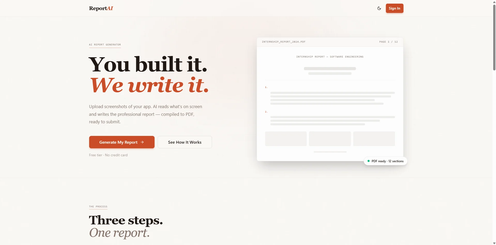

# ReportAI

<!-- Landing page preview -->

<p align="center">
  
</p>

**Turn your app screenshots into a professional PDF report — automatically.**

Upload screenshots or a screen recording of your project. AI analyzes what you built, groups features into sections, writes the report, and exports a polished PDF. Ready to hand in.

> Built for university students, bootcamp grads, and junior devs who spend hours manually documenting their work.

---

## How It Works

1. **Upload** — Drop a screenshots folder or a screen recording (MP4)
2. **Add context** — Project name, company, your role, dates (30 seconds)
3. **AI does the rest** — Vision model analyzes every screen, understands what each feature does, groups them, writes professional prose
4. **Download** — Professional PDF + optional `.tex` source file for Overleaf

**Your AI cost per report: ~$0.05. Your time saved: 3–6 hours.**

---

## Features

- Screen recording → intelligent frame extraction (only captures meaningful changes)
- Reviewer agent — automatically filters blurry, duplicate, and irrelevant frames
- AI understands your app semantically, not just visually
- Multiple output styles: Academic, Professional, Technical, Casual
- LaTeX output — looks proper, compiles in Overleaf
- University template support (IST, FEUP, ENSIIE, INSA, and more)
- Multilingual — English, Portuguese, French, German, Spanish, and more
- Download raw `.tex` to edit in Overleaf
- **Chat editing** — after generation, ask AI to rewrite sections, change tone, translate, add or remove screenshots; all edits compile to a new PDF in one pass
- **Reference documents** — upload a PDF or text file (project spec, brief, requirements) so the AI can draw on it when writing each section
- **Logo & cover customization** — upload a logo to place on the cover page or page header; customize title/field font sizes, custom fields (student name, supervisor, etc.), and header/footer text
- **Inline section editor** — directly edit prose in-browser with a rich text editor (TipTap); figure references rendered as interactive chips; one-click compile to PDF

---

## Self-Hosting

**Requirements:** Node 20+, Docker (optional), a Google AI Studio API key, Cloudflare R2 bucket, Neon (or any Postgres) database, Redis.

### With Docker (recommended)

```bash
git clone https://github.com/yourusername/reportai
cd reportai

cp backend/.env.example backend/.env
# Edit backend/.env and fill in your credentials

docker compose up
```

Backend runs on `http://localhost:4000`, frontend on `http://localhost:3000`.

### Without Docker

```bash
git clone https://github.com/yourusername/reportai
cd reportai

# Backend
cd backend
cp .env.example .env
# Edit .env and fill in your credentials
npm install
npm run prisma:push
npm run dev          # http://localhost:4000

# Frontend (new terminal)
cd frontend
cp .env.example .env
npm install
npm run dev          # http://localhost:3000
```

See [`backend/.env.example`](./backend/.env.example) and [`frontend/.env.example`](./frontend/.env.example) for all required variables.

---

## Tech Stack

| Layer | Technology |
|---|---|
| Frontend | Next.js 16 (App Router), Tailwind CSS, shadcn/ui |
| Backend | Express 5, TypeScript |
| Vision AI | Gemini 2.5 Flash |
| Writing AI | Gemini 2.5 Pro (sections) + Flash (cluster, intro, conclusion, edits) |
| AI SDK | Vercel AI SDK 6 |
| Storage | Cloudflare R2 |
| Database | Neon (Postgres) via Prisma |
| Background Jobs | BullMQ + Redis |
| Auth | Better Auth (Google OAuth) |
| LaTeX | pdflatex (texlive, bundled in Docker) |
| Payments | Stripe |

---

## Pricing (hosted version)

| Plan | Price | Reports |
|---|---|---|
| Free | $0 | 1 report (watermarked) |
| One-time | $9 | 1 clean report + .tex source |
| Unlimited | $15/month | Unlimited + university templates |

---

## Contributing

PRs welcome. The core pipeline is where the interesting work is — better prompts, more LaTeX templates, smarter frame clustering.

```
backend/src/pipeline/
  reviewer.ts   # Blur detection, dedup, threshold retry loop
  vision.ts     # Gemini Flash — describe each screenshot + classify image type
  cluster.ts    # Group screenshots into sections (Flash) — assigns side-by-side pairs
  docmapper.ts  # Map reference document excerpts to sections (Flash)
  writer.ts     # Write narrative prose per section (Pro for bodies, Flash for intro/conclusion)
  latex.ts      # Build LaTeX document + compile to PDF (logo, header/footer, cover config, side-by-side figures)
  editor.ts     # Post-generation editing — editDocument, addScreenshot, removeScreenshot, setLogo, compileCurrentReport
```

Open an issue before starting large changes.

---

## License

MIT — core pipeline is fully open source. Use it, fork it, deploy it yourself.

---

*Built because writing internship reports manually is one of the most painful, pointless hours of a developer's life.*
